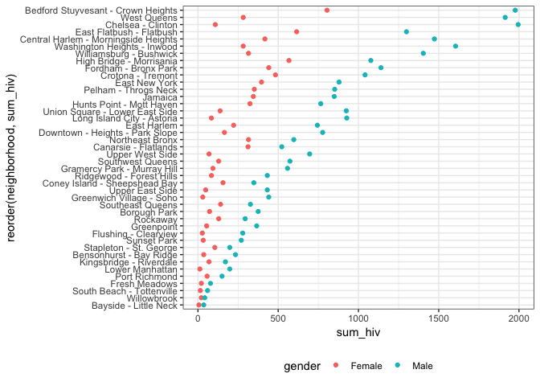

Visualization
================

First, import and tidy data:

``` r
hiv_data = read_csv("./data/DOHMH_HIV_AIDS_Annual_Report.csv") %>% 
  janitor::clean_names() %>% 
  rename(neighborhood = uhf) %>% 
  filter(year != "ALL", borough != "All", neighborhood != "All", gender != "All") %>% 
  mutate(year = as.character(year), age = as.factor(age))
hiv_data 
```

    ## # A tibble: 5,040 x 18
    ##    year  borough neighborhood gender age   race  hiv_diagnoses
    ##    <chr> <chr>   <chr>        <chr>  <fct> <chr>         <int>
    ##  1 2011  Bronx   Crotona - T… Female 13 -… All               1
    ##  2 2011  Bronx   Crotona - T… Female 20 -… All               5
    ##  3 2011  Bronx   Crotona - T… Female 30 -… All              12
    ##  4 2011  Bronx   Crotona - T… Female 40 -… All               7
    ##  5 2011  Bronx   Crotona - T… Female 50 -… All               5
    ##  6 2011  Bronx   Crotona - T… Female 60+   All               1
    ##  7 2011  Bronx   Crotona - T… Female All   All              31
    ##  8 2011  Bronx   Crotona - T… Female All   Asia…             0
    ##  9 2011  Bronx   Crotona - T… Female All   Black            16
    ## 10 2011  Bronx   Crotona - T… Female All   Lati…            13
    ## # ... with 5,030 more rows, and 11 more variables:
    ## #   hiv_diagnosis_rate <dbl>, concurrent_diagnoses <int>,
    ## #   percent_linked_to_care_within_3_months <int>, aids_diagnoses <int>,
    ## #   aids_diagnosis_rate <dbl>, plwdhi_prevalence <dbl>,
    ## #   percent_viral_suppression <int>, deaths <int>, death_rate <dbl>,
    ## #   hiv_related_death_rate <dbl>, non_hiv_related_death_rate <dbl>

``` r
hiv_data %>% 
  group_by(neighborhood, gender) %>% 
  summarise(sum_hiv = sum(hiv_diagnoses)) %>% 
  ggplot(aes(x = reorder(neighborhood, sum_hiv), y = sum_hiv, color = gender)) + 
  coord_flip() +
  geom_point() 
```


